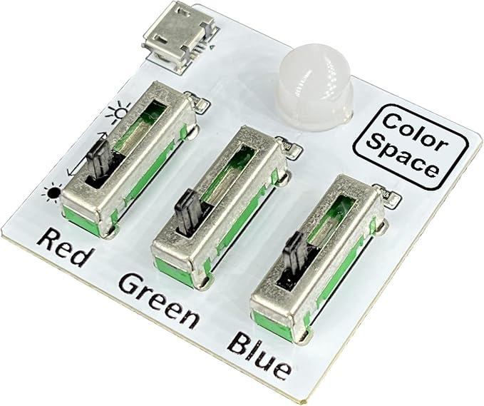

# Real-Time Planet Tracker 

Using a GPS, an IMU module, Servo motors, and a laser, this real-time planet tracker will visually show the location and trajectories of different celestial bodies and will be able to predict their paths and positions over time as well. 


| **Engineer** | **School** | **Area of Interest** | **Grade** |
|:--:|:--:|:--:|:--:|
| Saketh S | Saint Francis High School | Aerospace/Mechanical Engineering | Incoming Senior


<!--.png) -->


# Modifications 

For my main modification to this project, I wanted to find a way to keep all my circuitry organized, intact and secure. My wiring was all over the place, and the connections to my servo motors and laser were frequently disconnected or broken entirely when running the code. To fix this, I used CAD modeling on Onshape to create a hollow box-like case that would have adequate space between top and bottom to fit my breadboard and Mega away from each other, as well as a cutout for my servo motors to be fitted into. It also features holes on either sides to thread the GPS module through and for an opening for the Servo power connection port. [Here](https://cad.onshape.com/documents/aed883b26d9073cf22171671/w/91b97a96b15fd0522a5b3adb/e/5ede6d877e0c7b5273e45bed?renderMode=0&uiState=68902d27537ba56961986250) is my schematic in Onshape.


  
# Final Milestone


<iframe width="560" height="315" src="https://www.youtube.com/embed/YMEJdc4_cEc?si=YkhK3B43rg3Zn3_W" title="YouTube video player" frameborder="0" allow="accelerometer; autoplay; clipboard-write; encrypted-media; gyroscope; picture-in-picture; web-share" referrerpolicy="strict-origin-when-cross-origin" allowfullscreen></iframe>


## Accomplishments 
Since my previous milestone, I have made significant accomplishments that are crucial to the completion of this project. All mathematical calculations are fully complete and accurate to the point where the azimuth and altitude are displayed properly and correctly in the serial monitor, and the laser can properly point at the location of a planet where it would appear in the sky. The motors are able to move flawlessly at this point as well, and there are very minimal issues with default servo calibration and resetting. 


## Challenges and Triumphs
My project would ultimately have never been finished the way it was without the various setbacks and accomplishments throughout. Learning the basics of servo motors and connecting/operating them effectively was a crucial fundamental step that, even though long, tedious, and frustrating at times, were integral to the success of this project that people can visually see. Of course, understanding, testing, and implementing the numerous different ways to calculate orbital elements for azimuth and altitude was probably the most difficult part of this whole process. It was through focused trial-and-error, research, and collaboration that these roadblocks were overcome and the project worked efficiently. Every minor and major struggle I went through in this process made the project end up the way it did, and I am really glad that I went through these various experiences. 

## Key Topics
At Bluestamp, I explored and learned a great variety of concepts and skills that are fundamental to pursuing further success in engineering. I started off with learning and refining basic techniques and methods necessary for mastering engineering hardware, such as soldering, connecting wires, and other similar skills. Over the course of the program, I also discovered various different principles and concepts specific to my project, like complex orbital mechanics, the functionality of my particular servo motors, how a potentiometer controls them, and much more. Learning and experimenting with all of these gave me a much better and more vivid understanding of the multifaceted foci of engineering, and the many different ways that I could become deeply involved in these disciplines. 


# Second Milestone


<iframe width="560" height="315" src="https://www.youtube.com/embed/JIHNxqVbWq8?si=2UA81B0krCeNUy9e" title="YouTube video player" frameborder="0" allow="accelerometer; autoplay; clipboard-write; encrypted-media; gyroscope; picture-in-picture; web-share" referrerpolicy="strict-origin-when-cross-origin" allowfullscreen></iframe>

## Accomplishments 
I have made many progress updates since my first milestone. One of the major tasks I have accomplished was experimenting with the Servo motor drive shield, particularly because how it would make my project more advanced and efficient. Using the drive shield properly would have decreased the number of power connections to my motors and would allow me to make my wire connections for the servos a lot cleaner. Unfortunately this caused a lot of issues in my code and servo movement, so I had to remove it ultimately. Another important accomplishment for this milestone was connecting and using the larger, more powerful winch servos which would make my movement and planetary tracking much more advanced and realistic. 


## Challenges and surprises
So far, I have encountered a variety of challenges, obstacles, and surprises along the way. The most significant of these were coordinating the functionality of the motors, especially with the new winch motors and drive shield. There were a lot of cumbersome issues with calibrating and controlling these motors with the potentiometer and my planet tracking code, and resolving many of these issues did set me back on my progress more frequently than I would have hoped.   

## Next Steps
Before the final milestone, I plan to fully integrate the mathematical calculations necessary to accurately find and visually point to a planet's position, as well as using the potentiometer/button to switch between tracking different planets or different modes of tracking. 

For your second milestone, explain what you've worked on since your previous milestone. You can highlight:
- Technical details of what you've accomplished and how they contribute to the final goal
- What has been surprising about the project so far
- Previous challenges you faced that you overcame
- What needs to be completed before your final milestone 


# First Milestone


<iframe width="560" height="315" src="https://www.youtube.com/embed/jdl2LDAWb-E?si=GAsgxw-DyhcmIB84" title="YouTube video player" frameborder="0" allow="accelerometer; autoplay; clipboard-write; encrypted-media; gyroscope; picture-in-picture; web-share" referrerpolicy="strict-origin-when-cross-origin" allowfullscreen></iframe>

************


For my first milestone in this project, I fully assembled and connected all the necessary hardware portions of the device. This includes the Arduino Mega, GPS receiver, IMU, pan/tilt servos, and the laser pointer. The code ran on the Arduino will match the observer's GPS coordinates with the RA and DEC values of a given celestial object at a certain time to find the location/trajectory of it and rotate the servos to point the laser at the approximate location of it. Some challenges I encountered while assembling and connecting all of this was that my soldering would sometimes not come out perfectly, especially with the wires of the laser and the header pins on the IMU and GPS. Another issue that I came across was to make sure that all the connections between the servos and other components of the project were secure and correct so as to not hamper the movement and rotation of the servos with full control from the potentiometer. For my next milestones, I will be integrating the GPS and IMU to work together in order to use the observer's location for effective pinpointing of a planet's orbit/position. 

<!---
# Schematics 
Here's where you'll put images of your schematics. [Tinkercad](https://www.tinkercad.com/blog/official-guide-to-tinkercad-circuits) and [Fritzing](https://fritzing.org/learning/) are both great resoruces to create professional schematic diagrams, though BSE recommends Tinkercad becuase it can be done easily and for free in the browser. 

# Code
Here's where you'll put your code. The syntax below places it into a block of code. Follow the guide [here]([url](https://www.markdownguide.org/extended-syntax/)) to learn how to customize it to your project needs. 

```c++
void setup() {
  // put your setup code here, to run once:
  Serial.begin(9600);
  Serial.println("Hello World!");
}

void loop() {
  // put your main code here, to run repeatedly:

}

-->

<!--
# Bill of Materials

| **Part** | **Note** | **Price** | **Link** |
|:--:|:--:|:--:|:--:|
| Item Name | What the item is used for | $Price | <a href="https://www.amazon.com/Arduino-A000066-ARDUINO-UNO-R3/dp/B008GRTSV6/"> Link </a> |
| Item Name | What the item is used for | $Price | <a href="https://www.amazon.com/Arduino-A000066-ARDUINO-UNO-R3/dp/B008GRTSV6/"> Link </a> |
| Item Name | What the item is used for | $Price | <a href="https://www.amazon.com/Arduino-A000066-ARDUINO-UNO-R3/dp/B008GRTSV6/"> Link </a> |

-->

# Starter Project: RGB Slider


<iframe width="560" height="315" src="https://www.youtube.com/embed/0HCLcSI6nYQ?si=S5emsxPb1mkO4H__" title="YouTube video player" frameborder="0" allow="accelerometer; autoplay; clipboard-write; encrypted-media; gyroscope; picture-in-picture; web-share" referrerpolicy="strict-origin-when-cross-origin" allowfullscreen></iframe>

**********

Ever wondered how different basic colors can be mixed to make amazing combinations? Look no further than the RGB Slider, where with just the sliding of a few switches you can combine red, green, and blue to uncover several amazing mixings of colors. Using some basic soldering techniques and wire connections, I created a small circuit with three switches for red, green, and blue respectively, and when a USB-C source was plugged into it, the sliders would enable the light to glow in many different color combinations. Some challenges I faced were that not all connections on the board were secured and working, so there had to be some extra soldering to fix these parts. Many of the power sources from outlets were not able to power the system as well, so an alternate power bank and cable had to be used. Overall, this was a succcessful and satisfactory preliminary project, and I look forward to building more advanced systems and mechanisms with the skills I learn. 




Link to product: https://www.amazon.com/gp/product/B0BKM3D927/ref=ppx_yo_dt_b_search_asin_title?ie=UTF8&psc=1


| **Part** | **Note** | **Price** | **Link** |
|:--:|:--:|:--:|:--:|
| DIY Soldering Practice Kit RGB Practice Learning Electronics Training Board | Kit with hardware for soldering together the components for RGB Slider(switches, USB-C port, light, PCB) | $7.99 | <a href="[https://www.amazon.com/Arduino-A000066-ARDUINO-UNO-R3/dp/B008GRTSV6/](https://www.amazon.com/gp/product/B0BKM3D927/ref=ppx_yo_dt_b_search_asin_title?ie=UTF8&psc=1)"> Link </a> |


